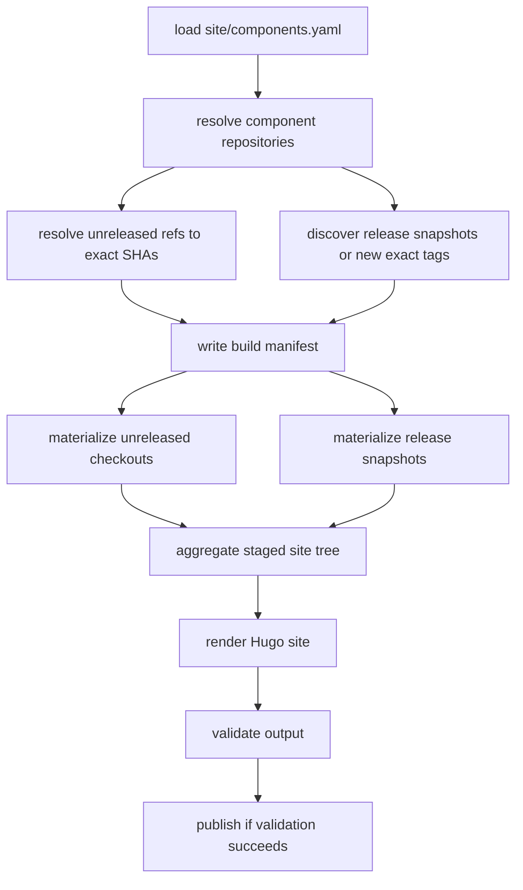

<!--
Copyright 2026 The Apache Software Foundation

Licensed under the Apache License, Version 2.0 (the "License");
you may not use this file except in compliance with the License.
You may obtain a copy of the License at

http://www.apache.org/licenses/LICENSE-2.0

Unless required by applicable law or agreed to in writing, software
distributed under the License is distributed on an "AS IS" BASIS,
WITHOUT WARRANTIES OR CONDITIONS OF ANY KIND, either express or implied.
See the License for the specific language governing permissions and
limitations under the License.
-->

# Proposal: CI build inputs and local workspace overrides

This document complements [`site-infra.md`](site-infra.md). It focuses only on two design gaps:

- how the site build should resolve component inputs in CI, and
- how developers should override checkout locations locally without changing the published catalog.

It intentionally does **not** restate the broader renderer, URL, indexing, or publication design.

## Problem statement

The implementation uses `localDir` in `site/components.yaml` as the path from which a component's docs are staged. That works for the local proof of concept, but it mixes two different concerns:

- **repository identity** — which Git repository provides the content,
- **workspace binding** — where that repository happens to be checked out on one machine.

That conflation becomes awkward in two common cases:

1. one Git repository provides more than one logical site component,
2. a developer has a non-standard checkout layout that should not be committed to the shared catalog.

## Proposed model

The catalog should separate component identity from workspace discovery.

### Component identity in the shared catalog

The shared catalog should describe the **canonical source** of each site component:

- `slug` — stable public component identifier,
- `repository` — canonical Git repository URL,
- `sourceRoot` — path inside that repository that owns the component's site contract,
- `metadataFile`, `pagesRoot`, `docsRoot`, `assetsRoot` — paths relative to `sourceRoot`.

`sourceRoot` defaults to `.`. This makes it possible for one repository to host multiple site components.

Example:

```yaml
components:
  - slug: mammoth-cache-gradle
    repository: https://github.com/apache/buildish-mammoth-cache-gradle
    sourceRoot: .
  - slug: site
    repository: https://github.com/apache/buildish
    sourceRoot: site
```

Under this model, `repository` answers **where the content comes from**, while a workspace-specific binding answers **where the checkout lives today**.

### Local workspace binding

Developers should provide local path overrides in an ignored file such as `site/components.local.yaml`.

That file should affect only local source resolution. It must not change:

- `slug`,
- `repository`,
- publication metadata,
- or the set of components that the published site claims to contain.

Example:

```yaml
schemaVersion: 1
workspace:
  components:
    mammoth-cache-gradle:
      checkoutDir: ../src/buildish-mammoth-cache-gradle
    no-gradle-wrapper-jar:
      checkoutDir: /worktrees/no-gradle-wrapper-jar
    site:
      checkoutDir: .
```

`checkoutDir` should point at the repository root checkout, not at the docs directory itself.

### CI workspace binding

CI should not rely on local-style path guessing. Instead, it should produce a resolved build manifest early in the workflow that records, for each included component/version input:

- `slug`,
- `repository`,
- `sourceRoot`,
- ref kind (`unreleased` or `release`),
- branch or exact tag,
- resolved commit SHA,
- checkout path or snapshot path used during the build.

Once created, the rest of the pipeline should consume only that manifest.

## Why this separation helps

### One repository can host multiple site components

Yes: a single Git repository may back multiple catalog entries, as long as each entry has a unique `slug` and a distinct `sourceRoot` and/or metadata path.

That means the site build can model a mono-repo or an internal component like the site itself without pretending that every component needs its own repository.

### Local overrides become machine-local only

Developers can map component slugs to actual checkout roots without committing those paths into `site/components.yaml`.

### CI becomes reproducible

The manifest turns moving references such as default branches and newly discovered tags into a fixed build input for one workflow run.

## Proposed precedence rules

Source resolution should follow this order:

1. CI manifest bindings, when running in CI
2. local overrides from `site/components.local.yaml`, when present
3. catalog checkout hints or conventional sibling discovery
4. missing checkout → skip component cleanly for local builds, fail only if CI marks it required

Content structure resolution should remain separate:

1. per-component overrides in `site/components.yaml`
2. component metadata
3. catalog defaults
4. built-in defaults

## Recommended CI flow

The main site workflow should split into two concerns:

- **source resolution**,
- **aggregation + render**.



## Scaling with many components and many tags

The expensive part is not the unreleased build; it is release aggregation if every site build re-checks every historical tag for every component.

### Cost of the naive model

If the build has:

- `P` components,
- `T` historical exact-release tags per component,

then a naive "clone and stage every tag on every build" model behaves roughly like **O(P × T)** content materializations. That becomes too expensive quickly once the component count and release count both grow.

Even if tag discovery itself is cheap, materializing every tagged docs tree on every CI run is not.

### Recommended model: incremental release snapshots

The site build should treat unreleased and released content differently:

- **unreleased docs**: resolve and stage from a live checkout of each component's default branch for the current run,
- **released docs**: consume from an incremental snapshot store, not from re-checking every historical tag.

The snapshot store can be the `versioned-docs` branch described in [`site-infra.md`](site-infra.md), or an equivalent immutable snapshot artifact store.

Under that model:

- unreleased aggregation cost is roughly **O(P)**,
- release discovery cost is roughly **O(P + new-tags)**,
- release content materialization cost is roughly **O(new-releases)** instead of **O(all-releases)**.

### Practical CI strategy

For each component, the resolver should:

1. fetch enough metadata to identify the default branch head,
2. enumerate exact tags matching the configured release pattern,
3. compare those tags with the known snapshot inventory,
4. snapshot only tags that are not already present,
5. record the resulting released-docs inventory in the build manifest.

This keeps the steady-state site build bounded even when the historical tag count is large.

## Recommended repository checkout strategy in CI

The workflow should avoid repeated full clones where possible.

- Repositories that back multiple site components should be checked out once and reused.
- Unreleased content should use one working tree per repository, not per slug.
- Release snapshots should be read from the snapshot store rather than from repeated tag checkouts.
- The final aggregation step should consume resolved filesystem inputs only.

This makes the operational cost closer to "number of repositories involved in this build" than "number of components times number of versions".

## Local developer workflow

The local experience should remain simple:

1. clone the main repository,
2. optionally clone any component repositories of interest,
3. create `site/components.local.yaml` if the checkout layout is non-standard,
4. run `make -C site serve` or `make -C site build`.

Developers should not need every repository to be present. Missing components should continue to degrade cleanly in local builds.

## Safety constraints for overrides

The local override file should be treated as a path-binding file only.

It should **not** allow overriding:

- the canonical repository URL,
- the component slug,
- release metadata,
- lifecycle state,
- or publication labels.

Override paths should still be validated conservatively:

- normalize and resolve symlinks before use,
- reject path traversal outside approved workspace roots,
- never follow content symlinks during copy,
- record the resolved path in local diagnostics for debugging.

## Suggested implementation sequence

1. Add `sourceRoot` to the shared catalog and treat it as the logical component root inside a repository.
2. Introduce `site/components.local.yaml` as an ignored local path-binding file.
3. Deprecate `localDir` in favor of a clearer name such as `checkoutHint` or `workspaceDir`.
4. Add manifest generation that resolves unreleased refs to exact SHAs at the start of CI.
5. Add incremental release snapshot discovery and reuse.

## Recommendation

The next design step should be to make the shared catalog describe **what** the site is built from, while local overrides and CI manifests describe **where those inputs are found for one build**.

That separation is the key to making the site build scale across:

- many components,
- many releases,
- mono-repo and multi-repo layouts,
- and developer workspaces that do not match the CI checkout layout.