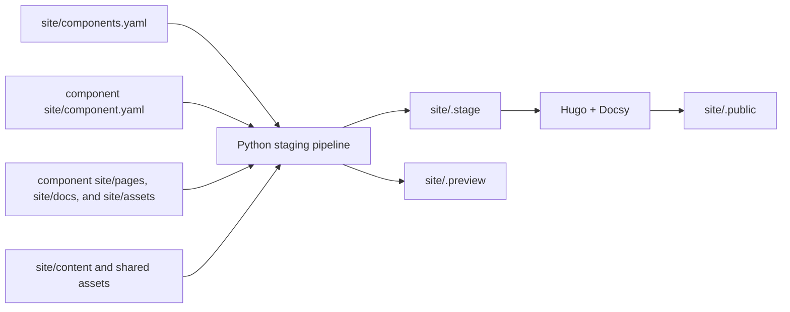
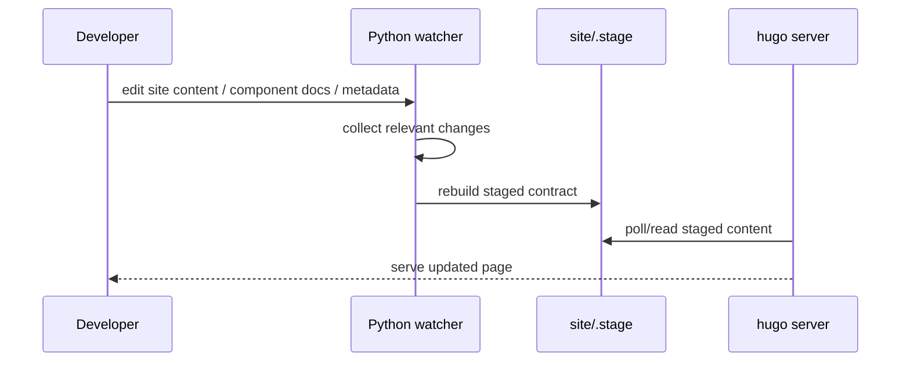

<!--
Copyright 2026 The Apache Software Foundation

Licensed under the Apache License, Version 2.0 (the "License");
you may not use this file except in compliance with the License.
You may obtain a copy of the License at

http://www.apache.org/licenses/LICENSE-2.0

Unless required by applicable law or agreed to in writing, software
distributed under the License is distributed on an "AS IS" BASIS,
WITHOUT WARRANTIES OR CONDITIONS OF ANY KIND, either express or implied.
See the License for the specific language governing permissions and
limitations under the License.
-->

# Apache Buildish site infrastructure

This document describes the implementation under `site/`.

The broader target architecture and future publication/release goals remain in
[`site-infra.md`](site-infra.md). The implementation is still
**unreleased-first and unreleased-only** in practice for versioned docs; stable,
non-versioned component landing pages come from authored `site/pages/_index.md`
content, while version-specific docs come from `site/docs/`.

## What the implementation provides

The code under `site/` provides:

- catalog-driven aggregation from `site/components.yaml`,
- per-component metadata loading from each component's `site/component.yaml`,
- authored component landing pages and version-independent component pages from each component's `site/pages/`,
- version-specific docs from each component's `site/docs/`, staged today as unreleased docs,
- normalized staged content and metadata under `site/.stage/`,
- local Hugo + Docsy rendering from that staged tree,
- watch-based restaging for interactive local development,
- an optional lightweight Python preview under `site/.preview/`, and
- containerized local/CI workflows with pinned tooling.

The component metadata contract is documented separately in
[`site-component-contract.md`](site-component-contract.md).

## Pipeline configuration

The staging CLI now supports both command-line overrides and an optional
workspace-owned configuration file at `site/site-pipeline.yaml`.

Current site-facing settings include:

- `site.siteTitle`
- `site.projectStatus` with allowed values `incubating`, `graduated`, or `retired`

Precedence is:

1. command-line arguments
2. `site/site-pipeline.yaml`
3. pipeline defaults

## Architecture overview

The implementation is split into an aggregation layer and a rendering layer.

### Aggregation layer

The Python pipeline under `site/pipeline/site_pipeline/` is responsible for:

- reading the catalog and component metadata,
- copying approved non-versioned pages, versioned docs, and static assets into a normalized tree,
- normalizing Markdown titles, summaries, and front matter,
- generating YAML data consumed by templates,
- writing a manifest describing the staged contract.

For component landing pages, the Hugo layer now renders the authored
`site/pages/_index.md` body directly instead of wrapping it in a fixed Buildish
hero/actions shell.

The rendering layer also provides a small set of site-owned shortcodes under
`site/layouts/shortcodes/` so component landing pages can link to pipeline-owned
component metadata without hard-coding URLs.

### Rendering layer

Hugo consumes the staged contract via `site/hugo.yaml`:

- `contentDir: .stage/content`
- `dataDir: .stage/data`
- `staticDir: [.stage/static, static]`
- `publishDir: .public`

This keeps the public renderer fed from one Buildish-owned staged contract
instead of reading arbitrary component repositories directly.

## Important directories

- `site/.stage/` — canonical staged input for Hugo
- `site/.preview/` — lightweight Python preview output written by full builds
- `site/.public/` — Hugo-rendered site output
- `site/resources/` — Hugo-generated resources
- `site/pipeline/` — Python staging package, tests, and `uv` metadata

Generated directories are ignored by Git and should usually be excluded in IDEs.

## Local workflows

From `site/`:

- `make serve` — run the staging watcher plus `hugo server` in a container
- `make build` — stage plus full Hugo render in a container
- `make render` — render the current staged site in a container

The above workflows run in a container by default. There are non-containerized
pendants for the main render workflows that run natively on the host (`-local` suffix).

Native host workflows remain available as `make serve-local`, `make build-local`,
and `make render-local`. Advanced containerized staging targets remain available as
`make stage` and `make stage-watch`.

If you want to inspect the static `site/.public/` output without running Hugo in
watch mode, run `make build`, then serve it locally, for example with
`python3 -m http.server --directory .public 8080` from `site/`.

## How `serve` works

`make serve` starts two long-lived processes in a container:

1. the Python watcher, which rebuilds `site/.stage/` when relevant inputs change
2. `hugo server`, which serves from `site/.stage/`

### Why watch mode only rebuilds `site/.stage/`

Watch mode intentionally calls the Python build with preview generation disabled.
That means repeated restaging during `make stage-watch` and
`make serve` rewrites `site/.stage/` only and leaves `site/.preview/`
untouched.

This is intentional for two reasons:

- Hugo serves from `site/.stage/`, not from `site/.preview/`
- rewriting `site/.preview/` on every save adds unnecessary external file churn

The lightweight preview tree is still generated by full `build` runs and by the
standalone Python preview server path.

### Why watch mode uses narrow watch roots

The watcher does **not** subscribe to all of `site/pipeline/` recursively.
Instead it watches a curated subset:

- `site/pipeline/main.py`
- `site/pipeline/pyproject.toml`
- `site/pipeline/uv.lock`
- `site/pipeline/site_pipeline/`

This avoids recursively watching tool-managed directories such as:

- `site/pipeline/.venv/`
- `site/pipeline/.idea/`

That reduction matters because IDEs and Python file watchers otherwise compete
over a much larger tree than the watcher actually needs.

### Why Hugo is configured with polling during serve

`make serve` runs `hugo server` with `--poll 700ms`. The staged tree is
rewritten by a separate Python process, so the implementation uses Hugo
polling as the compatibility-oriented way to notice those external restaging
updates reliably during development.

## Inputs and outputs

### Inputs

- `site/components.yaml` in the main repository
- `site/component.yaml` in each participating component
- optional `site/site-pipeline.yaml` in the main repository for pipeline/site defaults
- `site/pages/` in each participating component for non-versioned component pages
- `site/docs/` in each participating component for version-specific docs
- optional `site/assets/` in each participating component
- authored site content under `site/content/`

### Outputs

- `site/.stage/content/components/<slug>/_index.md` and any additional authored component pages
- `site/.stage/content/components/<slug>/unreleased/docs/...`
- `site/.stage/content/components/<slug>/unreleased/version.yaml`
- `site/.stage/content/components/<slug>/unreleased/_index.md`
- `site/.stage/data/components.yaml`
- `site/.stage/data/lifecycle.yaml`
- `site/.stage/data/aliases.yaml`
- `site/.stage/static/components/<slug>/unreleased/assets/...`
- `site/.stage/manifest.yaml`
- `site/.preview/` for the lightweight Python preview output
- `site/.public/` for the Hugo-rendered site

## Security and safety baseline

The implementation keeps the main safety guardrails from the broader
proposal:

- no arbitrary code execution from staged content,
- no path traversal outside approved repository roots,
- no symlink-following during staged content copying,
- reserved pipeline-owned component paths such as `unreleased/`, `releases/`, and `lifecycle.yaml` cannot be shadowed by authored `site/pages/` content,
- no remote fetching during normal local builds,
- no custom renderer logic contributed from component repositories.

## Known development-only limitations

- route removals can linger briefly in an already-running `make serve`
  session until Hugo is restarted
- release snapshot staging from exact tags is not implemented yet
- redirects, sitemap policy, and publication automation remain future work
