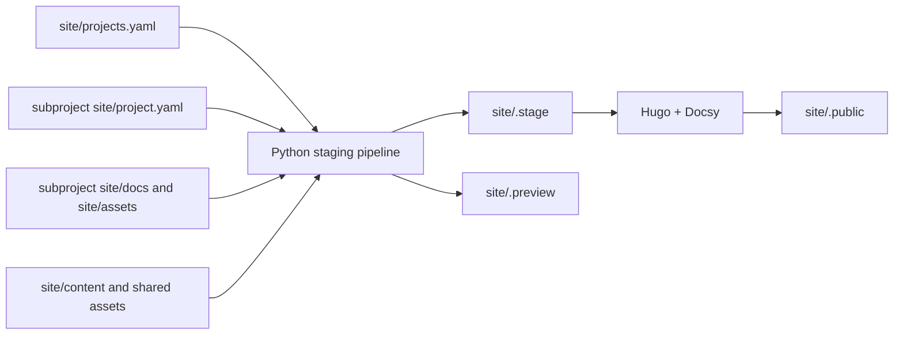
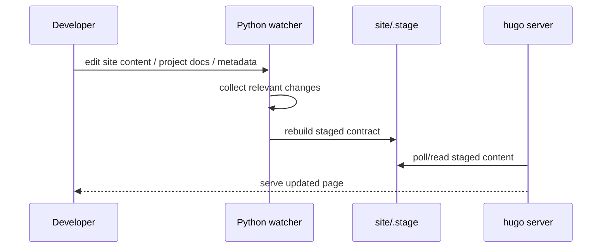

<!--
Copyright 2026 The Apache Software Foundation

Licensed under the Apache License, Version 2.0 (the "License");
you may not use this file except in compliance with the License.
You may obtain a copy of the License at

http://www.apache.org/licenses/LICENSE-2.0

Unless required by applicable law or agreed to in writing, software
distributed under the License is distributed on an "AS IS" BASIS,
WITHOUT WARRANTIES OR CONDITIONS OF ANY KIND, either express or implied.
See the License for the specific language governing permissions and
limitations under the License.
-->

# Current implementation: Buildish site infrastructure

## Status

This document describes the current implementation under `site/`.

The broader target architecture and future publication/release goals remain in
[`site-infra.md`](site-infra.md). The current implementation is still
**unreleased-first and unreleased-only** in practice; staging from exact release
tags is intentionally deferred until real release material exists.

## What the current implementation provides

The code under `site/` currently provides:

- catalog-driven aggregation from `site/projects.yaml`,
- per-project metadata loading from each sub-project's `site/project.yaml`,
- normalized staged content and metadata under `site/.stage/`,
- local Hugo + Docsy rendering from that staged tree,
- watch-based restaging for interactive local development,
- an optional lightweight Python preview under `site/.preview/`, and
- containerized local/CI workflows with pinned tooling.

The current sub-project metadata contract is documented separately in
[`site-subproject-contract.md`](site-subproject-contract.md).

## Architecture overview

The implementation is split into an aggregation layer and a rendering layer.

### Aggregation layer

The Python pipeline under `site/pipeline/site_pipeline/` is responsible for:

- reading the catalog and sub-project metadata,
- copying approved docs and static assets into a normalized tree,
- normalizing Markdown titles, summaries, and front matter,
- generating YAML data consumed by templates,
- writing a manifest describing the staged contract.

### Rendering layer

Hugo consumes the staged contract via `site/hugo.yaml`:

- `contentDir: .stage/content`
- `dataDir: .stage/data`
- `staticDir: [.stage/static, static]`
- `publishDir: .public`

This keeps the public renderer fed from one Buildish-owned staged contract
instead of reading arbitrary sub-project repositories directly.

## Important directories

- `site/.stage/` — canonical staged input for Hugo
- `site/.preview/` — lightweight Python preview output written by full builds
- `site/.public/` — Hugo-rendered site output
- `site/resources/` — Hugo-generated resources
- `site/pipeline/` — Python staging package, tests, and `uv` metadata

Generated directories are ignored by Git and should usually be excluded in IDEs.

## Local workflows

From `site/`:

- `make stage-local` — run one native staging pass
- `make stage-watch-local` — keep `site/.stage/` up to date on source changes
- `make build` — stage plus full Hugo render
- `make serve-local` — run the staging watcher plus `hugo server`

Containerized equivalents remain available as `make stage`, `make stage-watch`,
and `make serve`.

## How `serve-local` works

`make serve-local` starts two long-lived processes:

1. the Python watcher, which rebuilds `site/.stage/` when relevant inputs change
2. `hugo server`, which serves from `site/.stage/`

### Why watch mode only rebuilds `site/.stage/`

Watch mode intentionally calls the Python build with preview generation disabled.
That means repeated restaging during `make stage-watch-local` and
`make serve-local` rewrites `site/.stage/` only and leaves `site/.preview/`
untouched.

This is intentional for two reasons:

- Hugo serves from `site/.stage/`, not from `site/.preview/`
- rewriting `site/.preview/` on every save adds unnecessary external file churn

The lightweight preview tree is still generated by full `build` runs and by the
standalone Python preview server path.

### Why watch mode uses narrow watch roots

The watcher does **not** subscribe to all of `site/pipeline/` recursively.
Instead it watches a curated subset:

- `site/pipeline/main.py`
- `site/pipeline/pyproject.toml`
- `site/pipeline/uv.lock`
- `site/pipeline/site_pipeline/`

This avoids recursively watching tool-managed directories such as:

- `site/pipeline/.venv/`
- `site/pipeline/.idea/`

That reduction matters because IDEs and Python file watchers otherwise compete
over a much larger tree than the watcher actually needs.

### Why Hugo is configured with polling during serve

`make serve-local` runs `hugo server` with `--poll 700ms`. The staged tree is
rewritten by a separate Python process, so the current implementation uses Hugo
polling as the compatibility-oriented way to notice those external restaging
updates reliably during development.

## Current inputs and outputs

### Inputs

- `site/projects.yaml` in the main repository
- `site/project.yaml` in each participating sub-project
- `site/docs/` in each participating sub-project
- optional `site/assets/` in each participating sub-project
- authored site content under `site/content/`

### Outputs

- `site/.stage/content/projects/<slug>/unreleased/...`
- `site/.stage/data/projects.yaml`
- `site/.stage/data/lifecycle.yaml`
- `site/.stage/data/aliases.yaml`
- `site/.stage/static/projects/<slug>/unreleased/assets/...`
- `site/.stage/manifest.yaml`
- `site/.preview/` for the lightweight Python preview output
- `site/.public/` for the Hugo-rendered site

## Security and safety baseline

The current implementation keeps the main safety guardrails from the broader
proposal:

- no arbitrary code execution from staged content,
- no path traversal outside approved repository roots,
- no symlink-following during staged content copying,
- no remote fetching during normal local builds,
- no custom renderer logic contributed from sub-project repositories.

## Known development-only limitations

- route removals can linger briefly in an already-running `make serve-local`
  session until Hugo is restarted
- release snapshot staging from exact tags is not implemented yet
- search, redirects, sitemap policy, and publication automation remain future
  work rather than part of the current local implementation